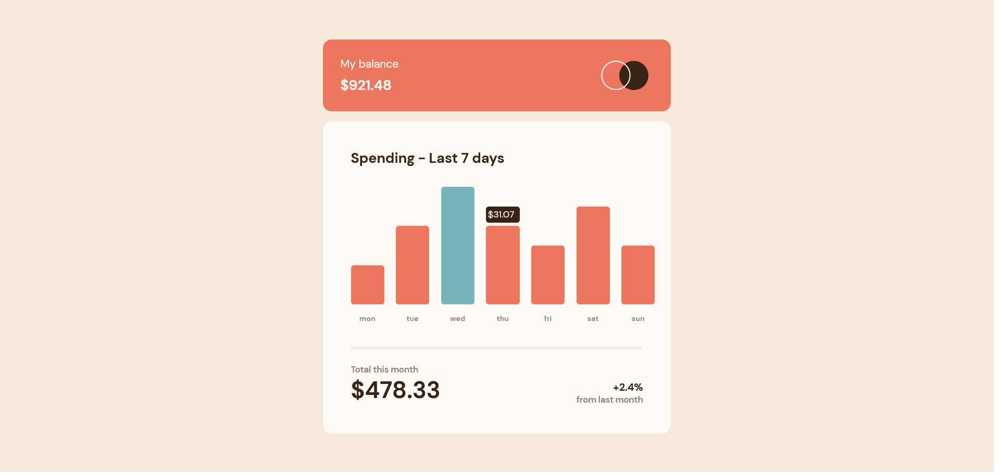
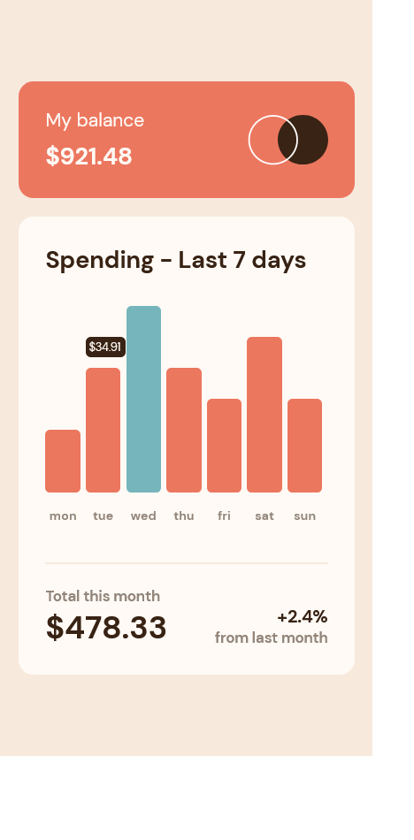

# Frontend Mentor - Expenses chart component solution

This is a solution to the [Expenses chart component challenge on Frontend Mentor](https://www.frontendmentor.io/challenges/expenses-chart-component-e7yJBUdjwt). Frontend Mentor challenges help you improve your coding skills by building realistic projects. 

## Table of contents

- [Overview](#overview)
  - [The challenge](#the-challenge)
  - [Screenshot](#screenshot)
  - [Links](#links)
- [My process](#my-process)
  - [Built with](#built-with)
  - [What I learned](#what-i-learned)
- [Author](#author)

## Overview

### The challenge

Users should be able to:

- View the bar chart and hover over the individual bars to see the correct amounts for each day
- See the current day’s bar highlighted in a different colour to the other bars
- View the optimal layout for the content depending on their device’s screen size
- See hover states for all interactive elements on the page
- **Bonus**: Use the JSON data file provided to dynamically size the bars on the chart

### Screenshot




### Links

- Solution URL: [GitHub](https://github.com/TomyAlberdi/Expenses-Chart-Component)
- Live Site URL: [Live Site](https://tomyalberdi.github.io/Expenses-Chart-Component/)

## My process

### Built with

- Flexbox
- CSS Grid
- Mobile-first workflow
- Sass

### What I learned

```js
fetch('./data.json')
.then((res) => res.json())
.then((data) => getData(data))
let getData = data => {
    dayArr.forEach(d => {
        d.addEventListener('click', e => {
            removeSpend()
            createSpend(data,d.id)
        })
    })
}
let createSpend = (data,id) => {
    let divP = document.createElement('div')
    let idn = parseInt(id,10)
    divP.classList.add(`div${idn+15}`)
    divP.classList.add(`day`)
    divP.innerHTML = "$" + data[id].amount
    graph.appendChild(divP)
}
let removeSpend = () => {
    let sp = document.querySelector('.day')
    if (sp !== null) {
        sp.remove()
    }
}
```

## Author

- Website - [Tomás Alberdi](https://tomyalberdi.github.io/portfolio/)
- Frontend Mentor - [@TomyAlberdi](https://www.frontendmentor.io/profile/TomyAlberdi)